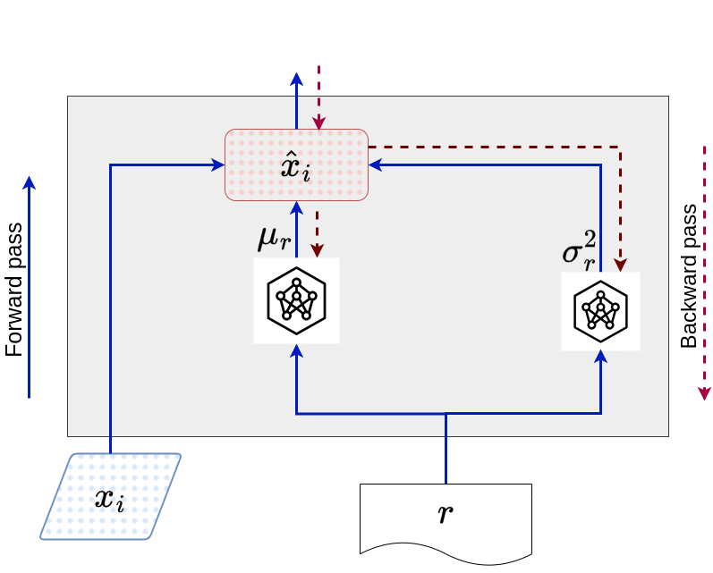

# <center>**Adaptative Context Normalization**</center>

## Paper Submitted to ICIP 2024. Bilal FAYE et al.
- Title: Adaptative Context Normalization
- Conference: International Conference on Image Processing (ICIP) 2024

  
This repository is an official implementation and applications of ACN: Adaptative Context Normalization.

## Introduction

ACN (Adaptive Context Normalization) is a novel approach in neural networks that leverages context-based data grouping for faster convergence and superior performance, distinguishing itself from traditional methods like Batch Normalization and Mixture Normalization.



**Abstract.** Deep Neural network learning faces major challenges related to changes in distribution across layers, which disrupt model convergence and performance. Activation normalization methods, such as Batch Normalization (BN), have revolutionized this field, but they rely on the simplified assumption of a single Gaussian component per batch.
To overcome these limitations, Mixture Normalization (MN) introduced an approach based on a Gaussian Mixture Model (GMM), assuming multiple components to model the data. However, this method entails substantial computational requirements associated with the use of GMM. 
We introduce Adaptative Context Normalization (ACN), an innovative approach that distinguishes itself by its independence from a GMM. ACN introduces the concept of "context", which groups together a set of data with similar characteristics. Data belonging to the same context are normalized using the same parameters, enabling local representation based on contexts. These normalization parameters for each context are learned similarly to the model weights during the backpropagation phase.
This approach ensures speed, convergence, and superior performance compared to BN and MN, while emphasizing the definition and utilization of contexts. It offers a fresh perspective on activation normalization in neural networks.

## Applications

ACN (Adaptive Context Normalization) can be used as a layer, it is compatible with any neural network architecture, and can be applied at any network level.


We offer the full version of ACN and a tiny ACN-base version, both of which are available in the "normalization" directory.

In this repository, we provide four experiments with ACN on classification and domain adaptation tasks using Vision Transformer (ViT) and Convolutional Neural Network (CNN) architectures:

* A Comparative Study: Adaptive Context Normalization vs.
Mixture Normalization with GMM Components as Contexts.

* Using Superclasses as Contexts in Adaptative Normalization<br>
    * Using CIFAR-100 Superclass as Context<br>
    * Using Oxford-IIIT Superclass as context

* Domain Adaptation: Using Source and Target Domains as Contexts

The experiments conducted in this study utilize several commonly used benchmark datasets in the classification community, including:

<center>

| Dataset               | Link                                  
|-----------------------|---------------------------------------
| CIFAR-10              | [CIFAR-10 Link](https://www.cs.toronto.edu/~kriz/cifar.html)     |
| CIFAR-100             | [CIFAR-100 Link](https://www.cs.toronto.edu/~kriz/cifar.html)    
| Tiny ImageNet         | [Tiny ImageNet Link](https://www.kaggle.com/c/tiny-imagenet) 
| Oxford-IIIT Pet Dataset | [Pet Dataset Link](https://www.robots.ox.ac.uk/~vgg/data/pets/)  
| MNIST digits          | [MNIST Link](https://yann.lecun.com/exdb/mnist/)         
| SVHN                  | [SVHN Link](http://ufldl.stanford.edu/housenumbers/)         

</center>

## Results 
### <center> A Comparative Study: Adaptive Context Normalization vs. Mixture Normalization with GMM Components as Contexts. </center>

In this experiment, we use a shallow deep CNN in architectures in Mixture Normalization [paper](https://arxiv.org/abs/1806.02892).

**Evolution of accuracy (%) on CIFAR-10**
| Model      | Learning Rate | 25 Epochs | 50 Epochs | 75 Epochs | 100 Epochs |
|------------|---------------|-----------|-----------|-----------|------------|
| BN-1       | 0.001         | 84.34     | 86.49     | 86.41     | 86.90      |
| BN-2       | 0.005         | 83.44     | 84.39     | 85.65     | 85.65      |
| MN-1       | 0.001         | 84.45     | 86.60     | 86.6      | 87.07      |
| MN-2       | 0.005         | 83.47     | 84.60     | 85.68     | 85.80      |
| ACN-base-1 | 0.001         | 85.9      | 86.93     | 87.09     | 87.11      |
| ACN-base-2 | 0.005         | 83.65     | 85.09     | 86.28     | 86.41      |
| ACN-1      | 0.001         | 84.68     | 86.61     | 87.38     | 87.57      |
| ACN-2      | 0.005         | 84.85     | 86.54     | 87.07     | 87.07      |

**Evolution of accuracy (%) on CIFAR-100**
| Model      | Learning Rate | 25 Epochs | 50 Epochs | 75 Epochs | 100 Epochs |
|------------|---------------|-----------|-----------|-----------|------------|
| BN-1       | 0.001         | 57.41     | 59.74     | 59.82     | 59.82      |
| BN-2       | 0.005         | 55.64     | 56.97     | 56.29     | 56.29      |
| MN-1       | 0.001         | 56.90     | 59.80     | 59.80     | 60.10      |
| MN-2       | 0.005         | 55.80     | 55.80     | 56.56     | 57.09      |
| ACN-base-1 | 0.001         | 57.74     | 61.01     | 61.01     | 61.01      |
| ACN-base-2 | 0.005         | 55.47     | 57.06     | 57.06     | 57.60      |
| ACN-1      | 0.001         | 58.50     | 59.25     | 59.65     | 61.02      |
| ACN-2      | 0.005         | 55.81     | 57.68     | 57.68     | 57.68      |

**Evolution of accuracy (%) on Tiny ImaageNet**
| Model      | Learning Rate | 25 Epochs | 50 Epochs | 75 Epochs | 100 Epochs |
|------------|---------------|-----------|-----------|-----------|------------|
| BN-1       | 0.001         | 37.17     | 37.17     | 37.17     | 37.17      |
| BN-2       | 0.005         | 34.11     | 34.11     | 34.11     | 34.11      |
| MN-1       | 0.001         | 38.18     | 38.17     | 38.5      | 38.5       |
| MN-2       | 0.005         | 34.56     | 34.99     | 35.12     | 35.27      |
| ACN-base-1 | 0.001         | 38.53     | 40.08     | 40.08     | 40.08      |
| ACN-base-2 | 0.005         | 34.78     | 35.44     | 35.44     | 36.71      |
| ACN-1      | 0.001         | 37.72     | 39.45     | 40.29     | 40.29      |
| ACN-2      | 0.005         | 37.97     | 38.31     | 38.31     | 38.31      |


### <center> Using CIFAR-100 Superclass as Context </center>

In this experimental setup, we employ the Vision Transformer architecture as our foundational model [source](https://keras.io/examples/vision/image_classification_with_vision_transformer/), and we introduce ACN as the initial layer within the model. For context, we utilize the superclass categorization of CIFAR-100.

| Model               | Accuracy | Precision | Recall | F1-Score |
|---------------------|----------|-----------|--------|----------|
| ViT+BN              | 55.63    | 8.96      | 90.09  | 54.24    |
| **ViT+ACN-base**    | 65.87    | **23.36** | 98.53  | 65.69    |
| **ViT+ACN**         | **67.38**| **22.93** | **99.00** | **67.13**|

### <center> **Using Oxford-IIIT Superclass as context** </center>

In this experiment, we employ a CNN architecture as the [baseline](https://github.com/mayur7garg/PetImageClassification/blob/master/Train.ipynb). We leverage the contexts of "Cat" and "Dog" superclasses and integrate ACN before the prediction dense layer.

| Model                  | Epoch      | Accuracy  | Precision  | Recall  | F1-Score  |
|------------------------|------------|-----------|------------|---------|-----------|
| OxfordCNN base         | Epoch 80   | 63.12     | 50.23      | 80.11   | 69.23     |
|                        | Epoch 113  | 66.55     | 53.11      | 84.2    | 72.15     |
| OxfordCNN+ACN-base     | Epoch 80   | 64.90     | 52.34      | 83.10   | 73.11     |
|                        | Epoch 113  | 67.52     | 55.12      | 86.13   | 75.90     |
| OxfordCNN+ACN          | Epoch 80   | **67.92** | **54.24**  | **89.11** | **80.12** |
|                        | Epoch 113  | **73.61** | **69.12**  | **92.34** | **90.11** |

### <center>**Domain Adaptation: Using Source and Target Domains as Contexts**</center>

To apply ACN coherently, we implement unsupervised domain adaptation using [AdaMatch](https://keras.io/examples/vision/adamatch/). In this scenario, the source domain is MNIST, and the target domain is SVHN.

**MNIST (source domain)**
| Model                 | Accuracy  | Precision  | Recall  | F1-Score  |
|------------------------|-----------|------------|---------|-----------|
| AdaMatch              | 97.36     | 87.33      | 79.39   | 78.09     |
| AdaMatch+ACN-base    | **99.26** | **99.20**  | **99.32** | **99.26** |
|                        |           |            |         |           |
| AdaMatch+ACN         | 98.92     | 98.93      | 98.92   | 98.92     |


**SVHN (target domain)**
| Model                 | Accuracy  | Precision  | Recall  | F1-Score  |
|------------------------|-----------|------------|---------|-----------|
| AdaMatch              | 25.08     | 31.64      | 20.46   | 24.73     |
| AdaMatch+ACN-base    | 43.10     | 53.83      | 43.10   | 47.46     |
|                        |           |            |         |           |
| AdaMatch+ACN         | **54.70** | **59.74**  | **54.70** | **54.55** |

## Citing Adaptive Context Normalization (ACN)

If you find ACN useful in your research, please consider citing:

```bash
@inproceedings{faye2024adaptative,
  title={Adaptative Context Normalization: A Boost for Deep Learning in Image Processing},
  author={Faye, Bilal and Azzag, Hanane and Lebbah, Mustapha and Bouchaffra, Djamel},
  booktitle={IEEE International Conference on Image Processing (ICIP)},
  year={2024}
}
```
